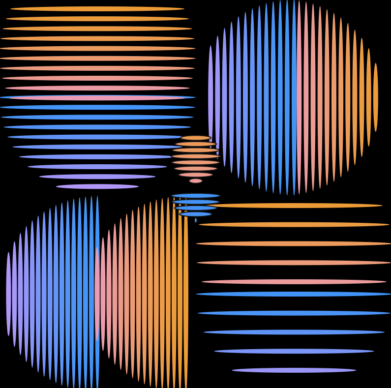
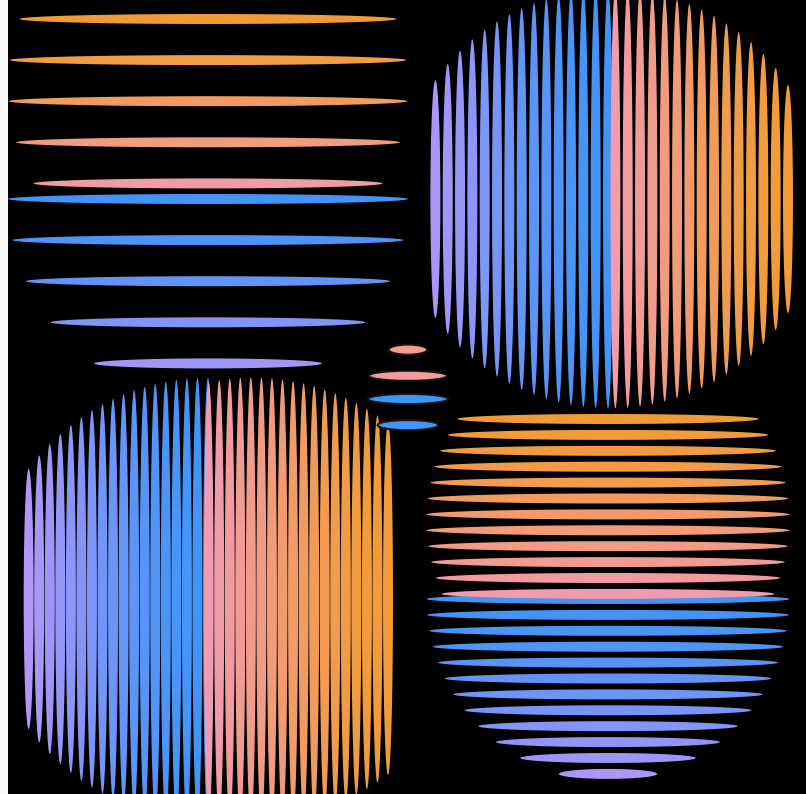

# Rhytmic Ellipses

**Link to the work:** https://editor.p5js.org/symbatb/sketches/-G5kIF615

**Concept:**

For this project, my concept was to create a dynamic generative art by using just a one shape – ellipse. I was interested in how ellipse can be manipulated to create an outline of various figures such as circles, triangles, blobs, etc.
As I started to play around with the ellipses, I was stuck on the problem of how I can make the ellipses follow the outline of a circle. After using some math, I eventually succeeded in forming the half-circle with ellipses, and then I applied the similar logic with x-axis reflection to form the other half.
I tried to utilize different concepts such as translation, rotation, randomization, etc. as much as possible, so I ended up creating an interesting form of generative art composed of 4 large and 1 small vibrating circles. The frame rate can be manipulated to change the speed of vibrations, in my case it is set to 5. The vibrations are achieved by manipulating the gaps between the ellipses and their width as well.

As for the color choice, I wanted to match the dynamic concept and the “wavy” vibe it gave, so I chose a black color for the background and a gradient color for the ellipses forming circles, which is achieved by manipulating the RGB values.

**Code:**

A code that I’m particularly proud of is the one where I draw circle by forming it from ellipses.  I used the Pythagorean theory (x^2+y^2=z^2) to get the length of a line that connects  two points in the circle which lie on the same line, and which is parallel to the diameter of the circle.  I used the for loop to gradually increment the width of the ellipse, and used x-axis reflection to form the other half of the circle.

**Future improvements:**

One of the ways this artwork could be improved is by increasing the size of the circles (i.e. making it 8×8) and applying a rotation effect that will make the circles rotate about the origin point. Another possible improvement would be randomizing the size and locations of the circles to create a more dispersed and random images.
