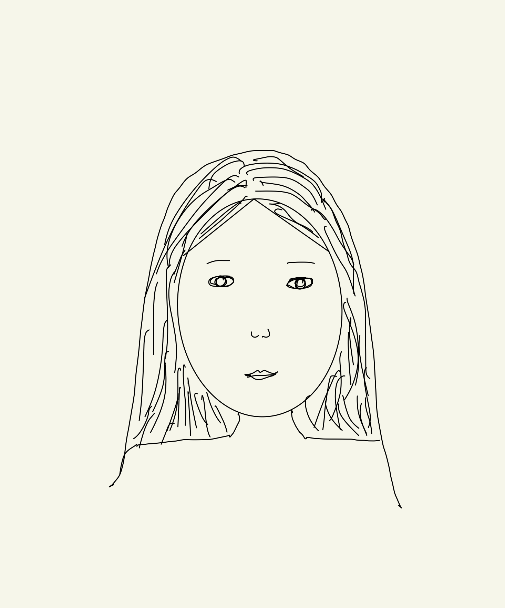

# Self-Portrait

For this project, I tried to utilize basic programming principles and primitive shapes to create a portrait of myself using p5.js.  I started my work with a preliminary sketch to figure out which shapes best represent different aspects of my facial features. When drawing it on the p5.js,  I relied mainly on the shapes such as circles, triangles, rectangles, arcs, and ellipses. Additionally, even though we weren’t asked to implement animation or any kind of interactivity, I decided to add some minor touches and make my avatar a bit interactive. Overall, this assignment helped me get familiar with the p5.js platform and understand how to translate complex designs and features into simple, primitive shapes.

Link to the work: https://editor.p5js.org/symbatb/sketches/RsPQHWEJg

**Concept:**

My concept for this project was to create a cartoon-style version of myself. It may not be 100% realistic, but I tried to convey my main facial features such as oval-roundish head, brown hair and eyes, round eyes, long neck, and etc. I also wanted to keep it realistic and minimalistic, therefore I didn’t add any special effects or accessories (except for a necklace).

***
Preliminary sketch:

**Code:**

The highlights of my code would be pupils that follow the direction of the mouse and a mouth that imitates talking when the mouse is clicked. I was inspired by a “Koala portrait” provided as a sample example in the homework description, so I decided to apply a similar concept to my work as well. The main idea behind moving pupils is that the location of the circles that are forming my pupils are dependent on the X and Y coordinate of the mouse. Those X and Y locations are multiplied by a small scalar number (in my case, it’s 0.02) and are added to the center of the circles.
With regards to the talking mouth animation, the shape of the mouth depends on whether the mouse is clicked or not. When it is clicked, the arc that is forming the mouth is drawn a bit thinner, but when it is not, the arc has a larger width.
I’m also proud of how proportions of different facial features turned out to be. All of these proportions were calculated with regards to the center of the ellipse that is forming my head.

**Future Improvements:**

One of the ideas for future improvements would be adding more details to my face such as eyelashes, make-up,  a detailed outline of the lips, etc. I would also work on my bangs as they didn’t turn out as much realistic as I wanted them to be. In terms of interactivity,  I think that making the eyelids close occasionally when talking (i.e. once in 7 mouse clicks) would make the talking animation more realistic.
